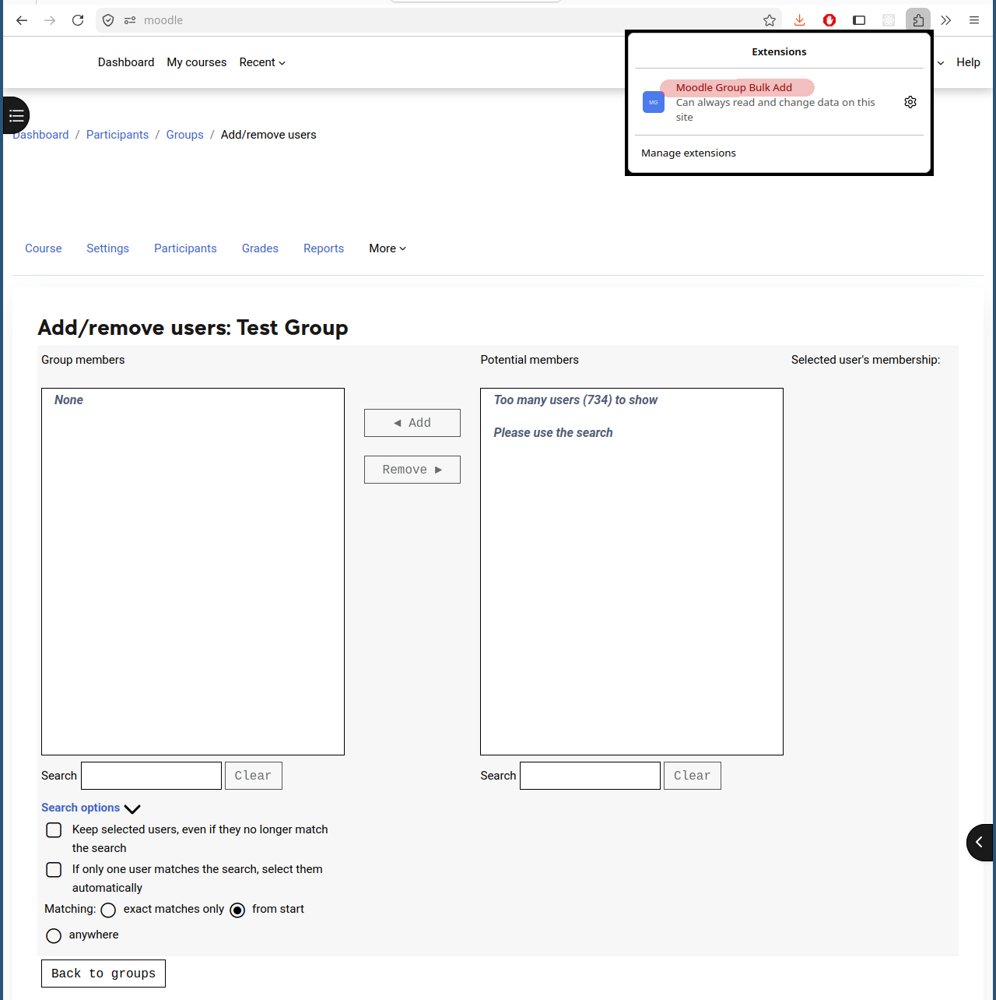
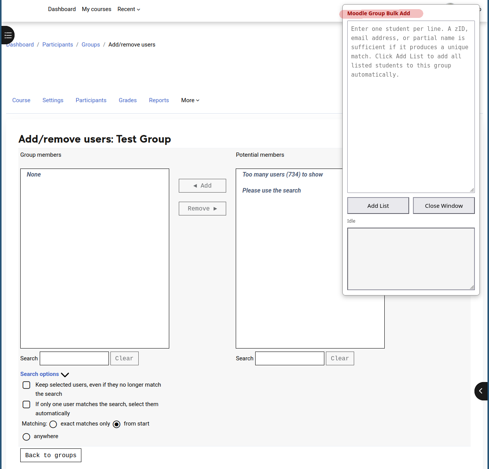
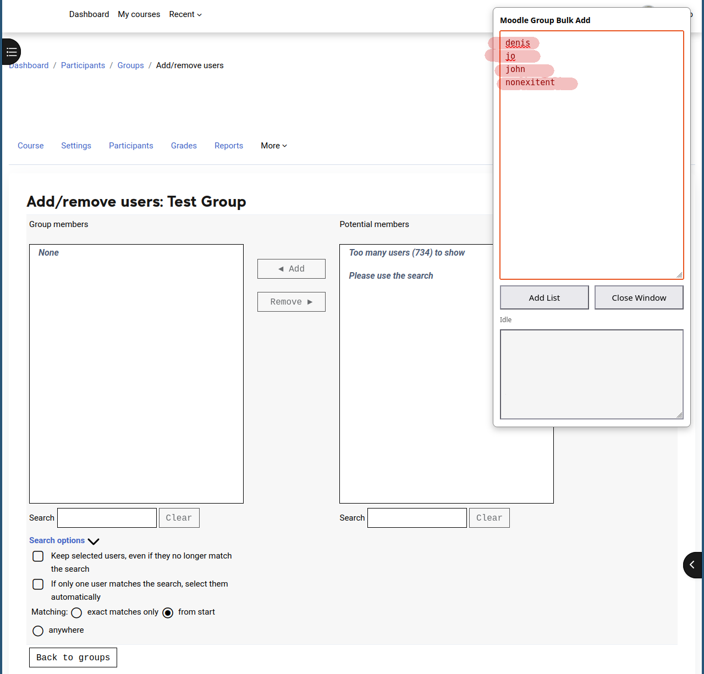
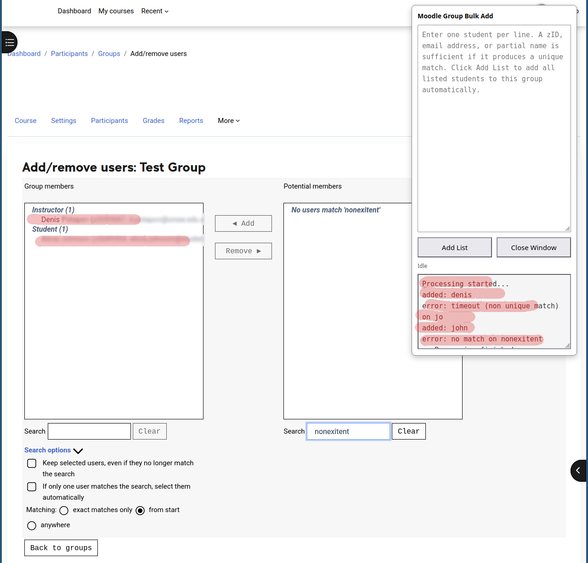

# Moodle Group Bulk Add

## Description

Moodle Group Bulk Add is a Firefox extension that allows multiple students to be added to a Moodle group in a single operation.

The standard Moodle group membership interface allows users to be added or removed one at a time. When managing large groups, this can be slow and repetitive.

With this extension, you can enter a list of students—one per line—and add them to a group automatically. Each entry can be a userID, email address, full name, or partial name, provided it uniquely identifies a student.

---

## Installation

Download the latest signed Firefox extension package from GitHub Releases:

**Latest Release**

[Latest Release](https://github.com/durackpl/moodle-group-bulk-add/releases/latest)

To install the extension:

1. Open Firefox.
2. Open the downloaded `.xpi` file, or drag it into a Firefox window.
3. Firefox will prompt you to install the extension.
4. Click **Add** to complete the installation.
5. The Moodle Group Bulk Add icon will appear in the Firefox toolbar.

---

# Using Moodle Group Bulk Add

## Step 1: Open the Extension

Click the **Moodle Group Bulk Add** icon in the Firefox toolbar.

---

## Step 2: Open the Extension Window

The extension window contains:

* A text area for entering the list of students to add (one per line).
* The **Add List** button, which starts the bulk-add operation.
* The **Close Window** button, which closes the extension window.
* A report area that displays the progress and results of the operation.

---

## Step 3: Enter the Student List

Enter one student per line.

Each entry may be:

* a userID,
* an email address,
* a full name,
* or a partial name.

You do not need to enter a student's full name. Any value that uniquely identifies the student is sufficient.

You can also paste a list of students directly from the clipboard.

---

## Step 4: Add the Students

Click **Add List** to start the bulk-add process.

The extension will automatically search for each student and add uniquely identified matches to the group.

The report area will display the outcome for each entry:

* **Added** — the student was uniquely identified and added to the group.
* **No match** — no matching student was found.
* **Multiple matches** — the entry matched more than one student and could not be added automatically.

Students that are successfully identified and added will also appear in the Moodle group membership list.

